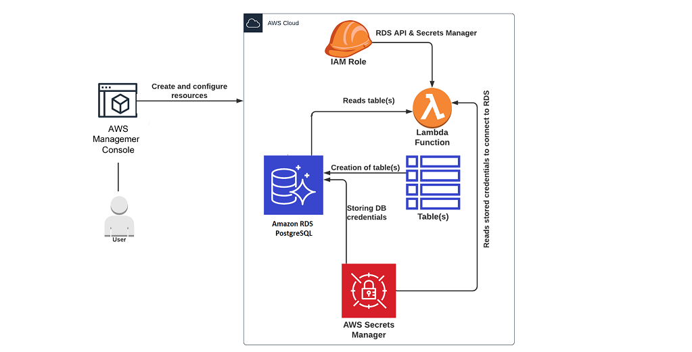
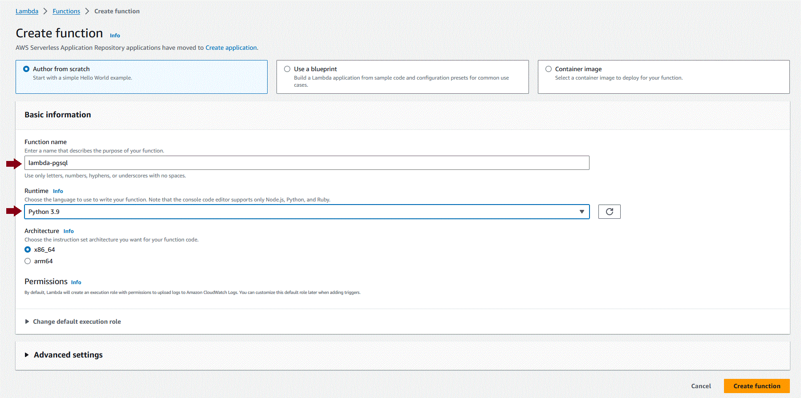
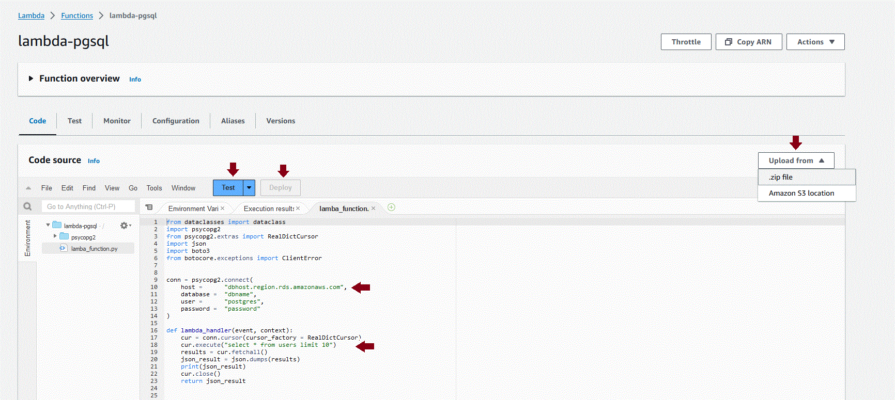
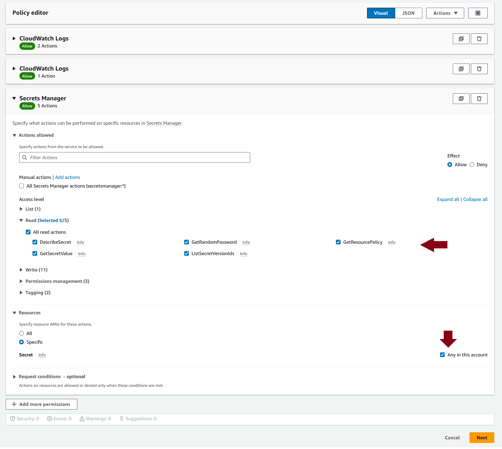

# Connecting AWS Lambda and RDS Postgres
This repo is for accessing RDS Postgres database from an AWS Lambda function. The [AWS Guide](https://docs.aws.amazon.com/AmazonRDS/latest/UserGuide/rds-lambda-tutorial.html) for connecting Lambda to RDS only works for MySQL at the moment and not Postgres.


## Usage Instructions
Requires Python 3.9 and psycopg2 2.9.9<br/>
The steps for configuring AWS services and deploying this as a Lambda function are:
##### 1) Create AWS Lambda Function
Go to AWS Services > Lambda > Functions > Create Function. <br/>
Configure as shown below, accept defaults for all other settings, and create the function.


##### 2) Upload Lambda Function as Zip
- Go the newly created function > Code > Upload From > Zip
- Upload the [AWSLambda-RDS-Postgres-Basic.zip](AWSLambda-RDS-Postgres-Basic.zip) from this repo. This contains the psycopg2 directory + a simplified lambda_function.py that does not require setting up AWS Secrets Manager.
- Once loaded, click on the ```lambda_function.py```. Update the database configuration - ```host```, ```database```, ```user``` and ```password``` in the script. Also update the SQL query to suit your database.
- Click on Deploy to apply the changes.
- Click on Test. This will prompt you to create a new Event. This event will be the one that would invoke the Lambda function. Specify a name and update the event JSON to be just an empty {}.
- Click on Test again. The function should now connect to the database specified, execute the query and return the results.


Note: AWS Lambda executes ```lambda_function.lambda_handler()``` by default. If you want to use a different filename or function name, update the Lambda Runtime Configuration on the AWS console.

##### 3) Store DB Credentials in AWS Secrets Manager
- Go to Services > Secrets Manager > Store a new Secret
- Select secret type as "Credentials for Amazon RDS Database"
- Enter the database username and password
- Select the RDS database from the list.
- Specify the secret name as 'db_credentials'
- Accept all other defaults and save the secret.

##### 4) Provide Lambda Function Access to the Secret
- Go to your Lambda function
- Go to Configuration > Permissions > Execution Role and click on the Role link.
- Click on the Permission Policies listed for the Role.
- In the Policy UI, in the Permissions Tab, click on Edit > Choose Visual > Add More Permissions.
- Select Secrets Manager from the services > Enable all the Read permissions > Under Resources, select Any secret in the region.
- Save the IAM policy.


##### 5) Deploy Lambda that reads from Secret Manager
- Go to the Lambda function > Configuration and refresh it so that the permission changes take effect
- Upload the [AWSLambda-RDS-Postgres.zip](AWSLambda-RDS-Postgres.zip) from this repo. This contains the lamba_function that retrieves the database credentials from AWS Secrets Manager, connects to the DB and returns the results from a table as JSON. 
- Once loaded, click on the ```lambda_function.py``` file.
  - Update the database configuration - ```host```, ```database```, ```user``` and ```password``` in the script.
  - Update the SQL query to suit your database.
  - Update the ```region_name``` to your region.
- Click on Deploy to apply the changes.
- Click on Test. The function should now connect to the database specified, execute the query and return the results.

## Why is psycopg2 included here
psycopg2 is the most popular PostgreSQL database adapter for Python. This is included here in this repo because fetching it automatically using ```pip install psycopg2-binary``` command results in the following Lambda execution error "Unable to import module 'rds_connector': No module named 'psycopg2._psycopg'". 

You need a version of psycopg2 with libpq.so statically linked for using it on AWS. This pre-built version of psycopg2 for Python 3.9 was obtained from https://github.com/jkehler/awslambda-psycopg2. If you need this for later versions of Python, you can also check https://pypi.org/project/aws-psycopg2/

